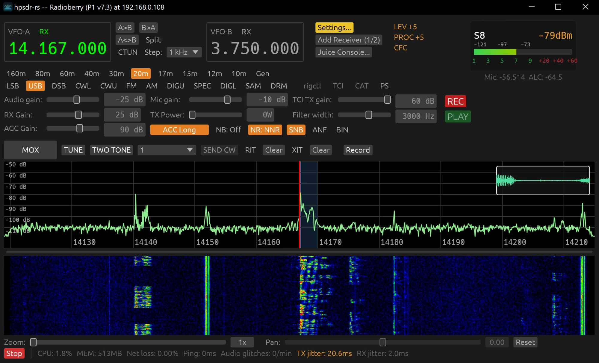

# hpsdr-rs


A Rust/egui desktop client for [openHPSDR](https://openhpsdr.org/) Protocol 1 and Protocol 2 radios (Metis/Ozy-style and Hermes/Orion-style boards), using [WDSP](https://github.com/NR0V/wdsp) for DSP.

> **Status: early / actively in development.** RX has seen the most real-world testing. TX works and has been used for real QSOs, but parts of the TX signal path are still noted in the source as unverified against the official protocol spec on untested hardware. **Always bench-test into a dummy load at reduced drive before transmitting into a real antenna**, especially after pulling a new build.



## Origins

This project started as an experiment: could Claude port the discovery code from rustyHPSDR -- originally written in GTK4 -- over to Rust's egui framework, which is more portable? That worked remarkably well. The plan at that point was to have Claude port the rest of rustyHPSDR to egui too, but that turned into a different question instead: having pointed Claude at the rustyHPSDR and piHPSDR source as reference, how much of a complete application could it actually develop from there? This project is the result so far. The only code I wrote by hand is the original discovery implementation that was ported to egui -- everything else came out of interacting with Claude and running real-hardware debugging sessions to chase down bugs.

-- John Melton, G0ORX/N6LYT

## Features

- Protocol 1 (Metis/Ozy) and Protocol 2 (Hermes/Orion) support, with standard openHPSDR UDP discovery (broadcast, port 1024)
- Multiple simultaneous receivers (main receiver + independent "extra receiver" windows), each with its own VFO, mode, filter width, and band memory
- Spectrum/waterfall display with adjustable dB range, palette, and Click-to-Tune (CTUN)
- SSB/CW/AM/FM/digital modes, per-mode/per-band filter width and mode memory
- Noise blanker (NB/NB2), noise reduction (NR/NR2/NNR), and SNB (spectral noise blanker), independently switchable
- AGC with selectable Off/Long/Slow/Medium/Fast modes
- TX: mic audio through WDSP's TXA chain, ALC, TX power/SWR meter with per-band PA calibration, and a Tune button (WDSP PostGen tone centered in the passband, at a separate reduced "Tune Power" for safe antenna/PA tuning)
- PureSignal (PA linearization/predistortion), on both Protocol 1 and Protocol 2 — see [PureSignal calibration](#puresignal-calibration) below for how to set it up
- rigctl (Hamlib-compatible), TCI (WebSocket), and CAT (Kenwood TS-2000 emulation) control servers, for use with WSJT-X, N1MM+, Log4OM, and similar logging/digital-mode software
- Dual VFO (VFO A/B) with Split -- transmit on VFO B while receiving on VFO A
- Selectable RX output / TX input audio devices (independent of the OS default), for routing through virtual audio cables
- Per-radio settings persistence (keyed by the radio's MAC address, so multiple physical radios each keep their own saved configuration)
- FPGA firmware upload and static IP configuration — see [Firmware update](#firmware-update) below
- MIDI control-surface support, several devices at once — see [MIDI control surface](#midi-control-surface) below

## Supported hardware

Any board the standard openHPSDR discovery protocol reports as one of: Metis, Hermes, Hermes2, Angelia, Orion, Orion2, HermesLite, or HermesLite2 (this covers most Protocol 1/2 hardware, including the ANAN series). The discovery/board-type reply doesn't distinguish specific models or their actual max power (e.g. a 100W vs. 200W ANAN both report as Orion2) — set your radio's actual max TX power in Settings once connected.

Also, separately: the original Ozy/Mercury/Penny hardware (Protocol 1 over USB rather than Ethernet) — see [Ozy USB](#ozy-usb-legacy-hardware) below. **New, partially confirmed against real hardware.**

And separately again: the receive-only [RX-888 Mk2](#rx-888-mk2-receive-only-direct-sampling-sdr) direct-sampling SDR — see that section below. **v1, unconfirmed against real hardware.**

The [Radioberry 2.x](https://github.com/jacintomfr/Radioberry-2.x) also works, via its own separate "Juice" USB-to-network bridge program (not part of this repo) — Juice talks to the board over USB and exposes it as a HermesLite2 over the normal openHPSDR discovery/UDP protocol, so once it's running the Radioberry shows up in the Discover window like any other network radio. The Discover window's **Radioberry Juice setup** section can launch Juice directly (Choose its executable, pick the FPGA variant, Launch) instead of needing a separate terminal. Prebuilt Juice installers (Windows MSI and Linux `.deb`, both tested end-to-end) are on that repo's [releases page](https://github.com/jacintomfr/Radioberry-2.x/releases).

## Building

Developed and tested primarily on Linux. A Windows build (via MSVC + vcpkg)
has also been confirmed to build and run successfully — see below. Two
Windows toolchains are supported. macOS builds successfully too, confirmed
via this repo's own CI (`.github/workflows/macos-build.yml`, real
`macos-latest` GitHub Actions hardware) — see its own section below.
Actually *running* it on macOS hasn't been confirmed against real radio
hardware yet, since CI has no radio to connect to.

**Linux:**
- A recent Rust toolchain (`rustup` recommended)
- FFTW3 development headers (`apt install libfftw3-dev` or your distro's equivalent)
- ALSA development headers for audio I/O (e.g. `apt install libasound2-dev`)

**macOS:**
- A recent Rust toolchain (`rustup` recommended)
- Xcode Command Line Tools, for a C compiler (`xcode-select --install`)
- [Homebrew](https://brew.sh/), then `brew install fftw pkg-config`
- No ALSA-equivalent package needed — `cpal` (audio I/O) talks to
  CoreAudio directly, built in to macOS
- Native (Apple Silicon or Intel) target, no cross-compilation flags
  needed — just `cargo build --release` like Linux
- The vendored WDSP C source (`build.rs`) branches on
  `#if defined(linux) || defined(__APPLE__)` internally via
  `vendor/wdsp/linux_port.c`/`.h`, ported by this project's own author
  from the upstream Windows-only source
- Confirmed building successfully via CI on real macOS hardware — not
  yet confirmed actually *running* against a real radio, so if
  something misbehaves at runtime on your Mac, please open an issue

**Windows via MSYS2/MinGW-w64:**
- [MSYS2](https://www.msys2.org/), then from an **MSYS2 MinGW64** shell: `pacman -S mingw-w64-x86_64-toolchain mingw-w64-x86_64-fftw mingw-w64-x86_64-pkg-config`
- Rust's `x86_64-pc-windows-gnu` target (`rustup target add x86_64-pc-windows-gnu`) -- and, since build scripts/proc-macros always compile for the *host* triple regardless of `--target`, either switch the default toolchain to it too (`rustup toolchain install stable-x86_64-pc-windows-gnu` then `rustup default stable-x86_64-pc-windows-gnu`, letting a plain `cargo build --release` work with no `--target` flag) or keep a `link.exe`-capable MSVC install around just for those host artifacts -- confirmed by a real build failing with `error: linking with `link.exe` failed` (MSVC's linker missing) the moment `--target x86_64-pc-windows-gnu` was passed while the *default* toolchain was still `-msvc`
- Build with `gcc`/`pkg-config` reachable on `PATH` (either build from that same MSYS2 MinGW64 shell, or add `<msys2 install dir>\mingw64\bin` to your own shell's `PATH`)
- The [Firmware update](#firmware-update) feature's Npcap SDK requirement (`NPCAP_SDK_DIR`, `Packet.lib`) applies here too, same as the MSVC bullets below -- `build.rs`'s Npcap discovery isn't MSVC-specific. Confirmed by a real MinGW build failing to link with `cannot find -lPacket` until `NPCAP_SDK_DIR` was set; a MinGW `ld.exe` can link directly against the SDK's MSVC-format `Packet.lib` with no conversion needed.
- Unlike the MSVC+vcpkg build below, this links fftw3 *dynamically* against MSYS2's `libfftw3-3.dll` rather than statically -- fine for `cargo run`/development (as long as `<msys2 install dir>\mingw64\bin` is on `PATH` at runtime too, not just build time), but anyone distributing just the `.exe` on its own (or [packaging it](#packaging-windows)) needs to bundle that `.dll` alongside it, or it fails to even launch with "libfftw3-3.dll was not found"
- Confirmed building AND installing/running successfully this way, including against real Radioberry hardware (2026-09-21)

**Windows via MSVC:**
- Visual Studio Build Tools (C++ workload) — needed for any `x86_64-pc-windows-msvc`-target Rust build regardless of this project
- [vcpkg](https://vcpkg.io/), with `vcpkg install fftw3:x64-windows-static-md` (**not** `x64-windows-static` -- confirmed by reading the pinned `vcpkg` crate's own triplet-selection source: with neither `RUSTFLAGS=-Ctarget-feature=+crt-static` nor `VCPKGRS_DYNAMIC` set, which is the default/common case, it looks for the `-static-md` triplet specifically -- static `.lib`s built against the same dynamic CRT a normal Rust/MSVC build links against, not the fully-static `-static` triplet, which needs the static CRT to match; a real report installing the plain `-static` triplet hit exactly this mismatch as `LibNotFound("package fftw3 is not installed for vcpkg triplet x64-windows-static-md")`), and either `VCPKG_ROOT` set to your vcpkg checkout or `vcpkg integrate install` run once
- No `PATH`/pkg-config setup needed — `build.rs` talks to vcpkg and locates MSVC directly
- Confirmed building AND running successfully this way (2026-08-19)
- The [Firmware update](#firmware-update) feature additionally needs the [Npcap SDK](https://npcap.com/#download) at build time (its `Packet.lib`) — download and extract it, then set `NPCAP_SDK_DIR` to that folder; `build.rs` adds its `Lib/x64` to the linker's search path automatically (same idea as `VCPKG_ROOT` above, not a native cargo/MSVC mechanism). A real "`Packet.lib` not found" link error on a fresh Windows build confirmed this step is actually needed — if it still can't be found with `NPCAP_SDK_DIR` set, double check the SDK zip's actual internal folder layout against `<NPCAP_SDK_DIR>\Lib\x64\Packet.lib`
- **The Npcap *SDK* above (for building) is a separate download from the Npcap *application* (for running)** — a real report hit the built `.exe` refusing to even launch (`STATUS_DLL_NOT_FOUND` immediately on start, before reaching anything on screen) with only the SDK installed. `build.rs` now delay-loads `Packet.dll` (MSVC-only linker feature) so this should only actually matter if you use the Firmware Update feature itself, not just to run the app at all — but this isn't yet confirmed on a real Windows build, so until it is: install [Npcap itself](https://npcap.com/#download) too (not just the SDK), in "WinPcap API-compatible Mode", the same as [Firmware Update](#firmware-update)'s own runtime requirement below

WDSP is vendored as C source under `vendor/wdsp` and built automatically from source by `build.rs` (via the `cc` crate) — no separate build step, and no prebuilt platform-specific binaries to obtain or keep in sync.

```sh
cargo build --release
```

## Running

```sh
cargo run --release
```

The app opens a discovery window that listens for radios on the network; select one to connect. Settings (frequency, mode, filter width, TX power, calibration, etc.) are saved automatically per-radio under `~/.config/hpsdr-rs/` (Linux), `%APPDATA%\hpsdr-rs\` (Windows), or `~/Library/Application Support/hpsdr-rs/` (macOS).

On Windows, a release build no longer pops up a console window alongside the app (a plain `cargo build`/`cargo run` debug build still does, for normal development) — its debug output goes to `%APPDATA%\hpsdr-rs\hpsdr-rs.log` instead.

The main window's toolbar has a **Record** button that saves the RX audio you're currently hearing to a WAV file under a `recordings` folder alongside the settings above — useful for capturing a signal to play back later, or to demonstrate a feature (see the [Noise Reduction demo](#noise-reduction-demo) below for an example).

See the **[User Manual](docs/manual/README.md)** for a full walkthrough of the UI -- every settings tab, tuning gestures, extra receivers, and the PureSignal/Diversity/Equalizer features.

### Fixed-resolution LCD kiosk mode

For running on a small, fixed-resolution panel (e.g. a Windows mini-PC driving a 1024x600 shack LCD) rather than a normal resizable desktop monitor, set `HPSDR_LCD_1024X600=1` before launching:

```powershell
$env:HPSDR_LCD_1024X600 = "1"
.\target\release\hpsdr-rs.exe
```

This locks the main window to exactly 1024x600, starts it fullscreen with no window decorations (no title bar), and disables resizing. Every secondary window (Settings, an extra receiver + its own Settings, the frequency-entry popup, the Radioberry Juice console, Discover, Firmware Update) is capped to stay inside that same 1024x600 area and opens centered within it, instead of their normal (larger) desktop sizes.

Since there's no native title bar to close a secondary window from, each one instead gets an on-screen **Min**/**Close** button pair (bottom-right corner) and responds to **Escape**. The Discover window also gains an **Exit** button (next to Start/Cancel/Firmware Update) to quit the whole app -- deliberately placed there rather than on the main Connected window, since that's also where the Radioberry Juice setup section's own **Stop** button lives, so shutting everything down surfaces both controls together instead of a one-click Exit on the main window silently leaving juice running in the background.

Off by default -- this is a fixed-size kiosk layout for a specific small panel, not a general "small screen" mode, so it would be actively wrong on a normal resizable desktop monitor.

**Known limitation**: a native OS file-picker dialog (e.g. "Choose..." for the Radioberry Juice executable path, or a firmware `.rbf` file) is a real Windows window, not part of this app's own UI -- its size/position is controlled by Windows itself, not by this app, so it can open larger than the 1024x600 panel or need scrolling to reach its own buttons. Windows remembers a common dialog's last-used size per user, so resizing it down once on the actual kiosk PC should make it stay that size on future opens.

## MIDI control surface

Any class-compliant MIDI controller's notes/CCs/pitch-bend can be bound to a radio action from **Settings -> MIDI**:

- **Several devices at once** -- check as many detected ports as you like (e.g. a button box AND a separate jog-wheel controller); every enabled device feeds the same set of bindings, so it doesn't matter which physical controller a given message came from.
- **Learn mode**: click **Learn**, move a control on your MIDI device, then pick which radio action to bind it to from a searchable list -- mirrors piHPSDR's own MIDI learn workflow. Covers VFO/RIT/XIT tuning, mode/band/filter-width stepping, MOX/Tune/Split, noise blanker/reduction, AF/AGC/mic/RF gain, PureSignal's live Running toggle, Diversity gain/phase, and sending one of Settings -> CW's 5 saved CW messages.
- **Buttons** (Note On/Off) can be bound "momentary" (act on both press AND release -- e.g. press-to-transmit/release-to-receive for MOX) instead of the default toggle-per-press.
- **Relative encoders/jog wheels** (Control Change, "Wheel" bindings) have a **Sensitivity** multiplier and a **Rate limit** (debounce) to tame a chatty, no-detent encoder, plus a choice of **Acceleration** style per binding:
  - **Fixed** (the default) -- every message moves by the same amount regardless of how hard/fast you spun the control; only how many messages arrive per second changes the effective speed. Deliberately magnitude-independent, so landing on an exact frequency stays predictable even on a controller whose relative-CC magnitude is itself erratic.
  - **Value-based** -- piHPSDR/deskHPSDR's own convention instead: a bigger/faster physical turn (which most encoders report as a larger CC value swing) moves further per message too, not just more messages per second.
- **Importing from Thetis**: Settings -> MIDI can import a Midi2Cat XML export (Thetis's Settings -> CAT/Midi -> Save As) directly into hpsdr-rs's own bindings, translating each recognized CAT command to its closest hpsdr-rs equivalent and reporting anything it couldn't translate.

## Firmware update

Two independent, unrelated ways to update a radio's FPGA firmware (`.rbf` file) or change its static IP, matching how the openHPSDR reference tools (Apache Labs' `HPSDRBootloader`/`HPSDRProgrammer`) split this into two separate utilities:

- **Bootloader mode** (Discovery screen → **Firmware Update...**) — for Metis, Hermes, Hermes2, Angelia, Orion, and Orion2. The radio must already be physically switched into bootloader mode (a jumper or slide switch, board-dependent) and power-cycled — nothing over the network can do this for you. Uses raw Ethernet frames, **not** IP/UDP, so it only works over a direct cable or a plain unmanaged switch (not through a router, VPN, or most managed switches), and needs elevated privileges on every platform:
  - **Linux**: run as root, or grant the built binary the capability once: `sudo setcap cap_net_raw+ep target/release/hpsdr-rs`
  - **Windows**: install [Npcap](https://npcap.com/) (in "WinPcap API-compatible mode") and run hpsdr-rs as Administrator
  - **macOS**: run as root, or grant access to `/dev/bpf*`
  
  If an upload is interrupted (dropped packet, timeout, cancelled) the radio's bootloader firmware itself has no way to recover — **power-cycle the radio before trying again**. This can't brick the radio permanently: Erase/Program can only reach the separate "Application" flash region, never the bootloader/recovery image itself.

- **In-application update** (while connected → Settings → Network → **Firmware Update...**) — works against a normally-running, already-connected radio, no physical switch needed. Less thoroughly verified than bootloader mode — prefer bootloader mode when available. Automatically stops this radio's active session first (required for the radio to actually respond) and reconnects once the update completes.

See the manual's **[Firmware Update](docs/manual/13-firmware-update.md)** page for the full step-by-step procedure and warnings.

## Ozy USB (legacy hardware)

> **New, partially confirmed against real hardware.** USB discovery and
> the FX2 firmware load stage have both been confirmed working on a
> real Ozy. FPGA bitstream load, RX/TX streaming, and I2C telemetry
> (Penny power/Mercury overload) are still unconfirmed — this
> development environment has no complete Ozy/Mercury/Penny setup to
> test the rest against. If you try it, reports (good or bad) are very
> welcome.

The original HPSDR hardware — an "Ozy" board (Cypress FX2 USB
controller + FPGA) paired with separate Mercury (RX) and Penny (TX/audio
codec) boards on a backplane — predates every other board this project
talks to, which all use Ethernet/UDP. Ozy speaks the same Protocol 1
framing over raw USB bulk transfers instead, and needs a bit of one-time
setup normal boards don't:

1. **Firmware files** — the Cypress FX2 RAM firmware (`ozyfw-sdr1k.hex`)
   and the FPGA bitstream (`Ozy_Janus.rbf`) are **bundled with
   hpsdr-rs** (sourced from the author's own piHPSDR repo, same
   GPL-2.0 license) — a `.deb` install or a `cargo run` from a source
   checkout both find them automatically, no setup needed. The
   Discover window's **Ozy USB setup** section shows which copy is in
   use and lets you override it with a different/custom build via
   **Choose...** if you ever need to.
2. **Linux only**: a udev rule for non-root USB access. Copy
   [`assets/90-ozy.rules`](assets/90-ozy.rules) to `/etc/udev/rules.d/`,
   then `sudo udevadm control --reload-rules && sudo udevadm trigger`
   (or just replug the device).
3. **Windows only**: Ozy's `fffe:0007` VID:PID needs a WinUSB driver
   bound to it via [Zadig](https://zadig.akeo.ie/) — Windows has no
   built-in generic driver for an unrecognized USB device.
4. **macOS**: no extra driver needed (nusb, the USB library this
   project uses, talks to IOKit directly) — untested either way.

Once set up, Ozy shows up in the normal Discover window like any other
radio (as "USB" instead of an IP address) — select it and click Start.
Connecting runs the full one-time bring-up (FX2 firmware load, a few
seconds for the device to re-enumerate, FPGA bitstream load) before
streaming begins, so the first connect takes noticeably longer than a
network radio.

Classic Ozy hardware is capped at 2 receivers (matching piHPSDR's own
documented limit — these boards are reported to hang with more), and
Diversity/PureSignal aren't available on it (no independent feedback
ADC in this hardware generation).

## RX-888 Mk2 (receive-only direct-sampling SDR)

> **v1, unconfirmed against real hardware.** This development
> environment has no USB access at all — every USB/firmware/streaming
> detail is ported directly from a real, working reference driver
> (ka9q-radio), but none of it has actually been run against a real
> RX-888 yet. If you try it, reports (good or bad) are very welcome.

An RX-888 Mk2 is a receive-only, direct-sampling HF SDR (Cypress FX3 +
LTC2208-class ADC) that streams its *entire* captured bandwidth as raw
ADC samples over USB, with no on-board tuner/DDC — hpsdr-rs does the
digital down-conversion (NCO mixer + CIC decimator) itself in software.
This first version is deliberately narrow in scope: **one receiver,
direct-sampling HF mode only, fixed decimation** (no "Add Receiver", no
tuner/VHF mode, no adjustable IF bandwidth yet) — proving the concept
before expanding it.

1. **Firmware file** — the Cypress FX3 RAM image (`SDDC_FX3.img`) is
   **bundled** with hpsdr-rs (MIT-licensed; see
   [`assets/rx888/PROVENANCE.md`](assets/rx888/PROVENANCE.md) for its
   real upstream), so no setup is needed here by default. Point the
   Discover window's **RX-888 USB setup** section at a different copy
   via **Choose...** only if you want to override it.
2. **Linux only**: a udev rule for non-root USB access. Copy
   [`assets/90-rx888.rules`](assets/90-rx888.rules) to
   `/etc/udev/rules.d/`, then
   `sudo udevadm control --reload-rules && sudo udevadm trigger` (or
   just replug the device).
3. **Windows only**: needs a WinUSB driver bound to both the unloaded
   (`04b4:00f3`) and loaded (`04b4:00f1`) PIDs via
   [Zadig](https://zadig.akeo.ie/), same reasoning as Ozy's `fffe:0007`.
4. **macOS**: no extra driver needed (nusb talks to IOKit directly) —
   untested either way.

Once set up, the RX-888 shows up in the normal Discover window like any
other radio (as "USB" instead of an IP address) — select it and click
Start. The receiver's step attenuator (0-31dB) reuses the existing
Settings → RX Attenuation control rather than adding a new one.

## Packaging (Debian/Ubuntu)

A `.deb` can be built with [`cargo-deb`](https://crates.io/crates/cargo-deb):

```sh
cargo install cargo-deb   # one-time
cargo deb
```

This produces `target/debian/hpsdr-rs_<version>_amd64.deb`, installing the binary to `/usr/bin/hpsdr-rs`, a desktop menu entry and app icon, and the README/manual under `/usr/share/doc/hpsdr-rs/`. Runtime dependencies (FFTW3, ALSA, etc.) are detected automatically from the built binary. Install with:

```sh
sudo apt install ./target/debian/hpsdr-rs_<version>_amd64.deb
```

If the project directory is under your home directory (the normal case), `apt` will likely print `Notice: Download is performed unsandboxed as root as file '...' couldn't be accessed by user '_apt'.` — harmless: `_apt` (the low-privilege user apt sandboxes its acquire step with) can't traverse into a private home directory (`drwxr-x---` by default), so apt just does that one step unsandboxed as root instead and warns about it. The install still succeeds; confirm with `dpkg -l hpsdr-rs`. To avoid the warning entirely, either `sudo dpkg -i` the file directly instead of `apt install`, or copy it to a world-readable path first (e.g. `/tmp`) before running `apt install` on it.

Rebuilding and reinstalling repeatedly (e.g. while testing local changes) with the crate's own `version` unchanged produces the exact same package version every time — `dpkg`/`apt` treat that as nothing to do, requiring `sudo dpkg -r hpsdr-rs` before the new one will install. `./scripts/build-deb.sh` avoids this: it's a thin wrapper around `cargo deb --deb-revision <n>` that auto-increments a local counter (`.deb-revision`, gitignored) on every run, so each build gets a genuinely newer Debian revision and installs over the previous one cleanly. Use it exactly like `cargo deb` — extra arguments are passed through, e.g. `./scripts/build-deb.sh --no-build`.

If the app panics on startup with `Library libxkbcommon-x11.so could not be loaded` (confirmed on a minimal Ubuntu, e.g. a fresh WSL2 install), install `libxkbcommon-x11-0` manually: `sudo apt install libxkbcommon-x11-0`. `egui`/`winit` load this X11 keyboard library at runtime via `dlopen` rather than linking it directly, so `cargo-deb`'s automatic dependency detection (which scans the binary's linked libraries) never sees it and can't add it to the package's own `Depends:` list.

### Testing the .deb on WSL2 (no separate Linux box needed)

A recent `wsl --install -d Ubuntu` (the Microsoft Store-backed WSL, not the legacy Windows optional feature) bundles **WSLg** even on Windows 10 -- check with `wsl --version`, look for a `WSLg version` line. WSLg gives the WSL distro its own X11 socket, Wayland socket, and PulseAudio server automatically (`/mnt/wslg/`, `$DISPLAY`, `$WAYLAND_DISPLAY`, `$PULSE_SERVER` are already set in every shell), so the full GUI -- including audio in/out -- runs with no extra display server to install. Only two things are needed beyond `libxkbcommon-x11-0` above:

- `sudo apt install libasound2-plugins pulseaudio-utils` -- the ALSA-to-PulseAudio bridge `cpal` (this project's audio crate) needs to reach WSLg's PulseAudio server; without it, mic input and audio output both fail to open (visible as ALSA `cannot find card '0'` errors in the log), which in turn hides the MOX/TUNE/CW/RIT/XIT row entirely (`tx_enabled` requires a working mic, see `main.rs`'s `tx_enabled` doc comment).
- For real hardware over USB (Ozy, RX-888, or a [Juice](https://github.com/jacintomfr/Radioberry-2.x)-bridged Radioberry running *inside* WSL2 too) rather than a network-attached radio: [usbipd-win](https://github.com/dorssel/usbipd-win) passes a USB device through to WSL2. From an **elevated** Windows PowerShell: `usbipd list` to find the device's `BUSID`, then `usbipd bind --busid <id> --force` (`--force` is needed if a packet-capture filter like USBPcap is installed) and `usbipd attach --wsl --busid <id>`. This has to be repeated after every physical reconnect/reboot; there's no WSL-side persistence.

## Packaging (Windows)

An `.msi` installer can be built with [`cargo-wix`](https://crates.io/crates/cargo-wix), from a normal PowerShell prompt on a Windows machine already set up for a working build (either the [MSVC](#windows-via-msvc) or the [MSYS2/MinGW-w64](#windows-via-msys2mingw-w64) toolchain above) — this only packages an existing working build, it doesn't set one up:

```powershell
cargo install cargo-wix   # one-time
# Also one-time: install the WiX Toolset v3 (https://wixtoolset.org/,
# or `winget install WiXToolset.WiXToolset`) so candle.exe/light.exe
# are reachable. Its installer depends on the ".NET Framework 3.5"
# Windows feature (NetFx3) -- winget/the WiX installer will offer to
# enable it, but doing so needs an ELEVATED (Run as Administrator)
# prompt; if `winget install` fails with "This command requires
# administrator privileges", rerun it from an admin PowerShell. Once
# installed, if `cargo wix` can't find candle.exe/light.exe on its
# own, set the WIX env var to the install dir, e.g.:
#   $env:WIX = "C:\Program Files (x86)\WiX Toolset v3.14"
.\scripts\build-windows-release.ps1
```

This produces `target\wix\hpsdr-rs-<version>-x86_64.msi`, which installs `hpsdr-rs.exe` (icon embedded, via `winresource` in `build.rs`) under `Program Files\hpsdr-rs\bin`, adds that folder to `PATH`, and bundles the `LICENSE` file. The installer/uninstaller icon and WiX packaging config live in `wix/main.wxs` (generated once via `cargo wix init`, then hand-edited — see its own comments for how to further customize the install UI). Unlike the `.deb` case above, there's no local revision counter needed: WiX's `<MajorUpgrade>` element already reinstalls cleanly over an older version, so between releases just bump Cargo.toml's `version` like any other platform.

**Confirmed building AND installing/running successfully on real Windows hardware (2026-09-21), from a MinGW-w64 build.** One MinGW-specific gotcha found by that real run, now fixed in `wix/main.wxs`: unlike the MSVC+vcpkg build (which links fftw3 *statically* via the `x64-windows-static-md` vcpkg triplet), a MinGW-w64 build links fftw3 *dynamically* — the installed `hpsdr-rs.exe` failed to even launch with "libfftw3-3.dll was not found" until `libfftw3-3.dll` was added as its own bundled `File`/`Component` in `wix/main.wxs`, sourced from `C:\msys64\mingw64\bin\libfftw3-3.dll` (adjust that hardcoded path if your MSYS2 install lives elsewhere). Harmless to leave in for an MSVC-built installer too — the extra DLL is simply unused there. If you hit the same "libfftw3-3.dll was not found" error building this way, that's the fix; the `.dll` needs to already exist on disk (an ordinary MSYS2/MinGW build has already produced it) when `cargo wix` runs, since it doesn't build it itself.

## PureSignal calibration

PureSignal is enabled in Settings (takes effect on the next connect), then configured live in Settings → PureSignal while transmitting. The one setting that actually matters — and the thing to change first if calibration won't complete or `Correcting` never turns on — is **HW Peak**, which has to track the *real* envelope peak your radio produces at whatever drive level you're actually calibrating at. It is not a fixed per-board constant to leave alone, and the **Feedback Level** meter's "ideal" 90-256 range is only a rough guide, not a hard requirement — calibration has been confirmed working on real hardware at feedback levels both far below (single digits) and far above (thousands) that range, as long as HW Peak itself is right.

Procedure, on any radio:
1. Set **Tune Power %** low (start around 10-15%) — PureSignal calibration works best at a low real TX drive level, not a normal operating power.
2. Press **Two Tone** (not Tune — a steady tone's constant envelope can never fill PureSignal's calibration buckets) and watch **Measured Peak TX** in the PureSignal panel for a few seconds.
3. Set **HW Peak** to just above whatever Measured Peak TX settled at.
4. Re-engage Two Tone. `Correcting` should turn on within a few seconds. If it doesn't:
   - Stuck with Feedback Level at 0 and no progress: HW Peak is likely still too far from the true peak — recheck Measured Peak TX and adjust again.
   - `Correcting` flickers on/off or never turns on despite Feedback Level being nonzero: try nudging Tune Power % up or down a little and repeat from step 2 — the exact drive level a clean calibration converges at is somewhat radio-dependent.

## Noise Reduction demo

A real recording of 40m background noise, captured with the main window's own Record button (see [Running](#running) above), showing each of the Settings → RX → Noise Reduction options back to back on the same noisy signal. **[Listen to it here](https://g0orx.github.io/hpsdr-rs/audio-demo.html)** (GitHub Pages — GitHub itself doesn't support playing audio directly from a README or a repository file page), or [download the raw file](docs/audio/noise-reduction-demo.wav).

| Time | NR setting |
| --- | --- |
| 0-4s | `NR: Off` |
| 4-9s | `NR: NR` |
| 9-13s | `NR: NR2` |
| 13s-end | `NR: NNR` |

## Roadmap

Current focus is on stabilizing and testing Protocol 1 and Protocol 2 operation, including PureSignal, across more radios.

## Contributing

Issues and pull requests are welcome. A few things that'll help:

- **For anything touching the TX path**: bench-test into a dummy load at reduced drive before a real antenna, and say in the PR description what you actually tested it against (mode, protocol, hardware). Several TX bugs in this project's history turned out to be protocol- or radio-specific, so mentioning which you used helps a lot.
- **Reference-driven DSP/protocol changes**: where this project's behavior is meant to match a known-working implementation (piHPSDR, rustyHPSDR, Thetis, or the official openHPSDR protocol docs/WDSP source), please check against the actual reference rather than a plausible-sounding guess, and say which reference and where in the PR/commit message. A few real bugs here came from parameter changes that sounded reasonable but turned out not to match how any working reference actually behaves.
- **Comments**: explain *why*, not *what* -- code should already say what it does. A comment earns its place by capturing a non-obvious constraint, a reference confirmation, or the reasoning behind a fix, not by restating the line below it.
- For larger changes, opening an issue first to discuss the approach is appreciated before investing in a big PR.

## License

GNU General Public License, version 2 or (at your option) any later version -- see [LICENSE](LICENSE). This matches WDSP's own license, which hpsdr-rs statically links against.
